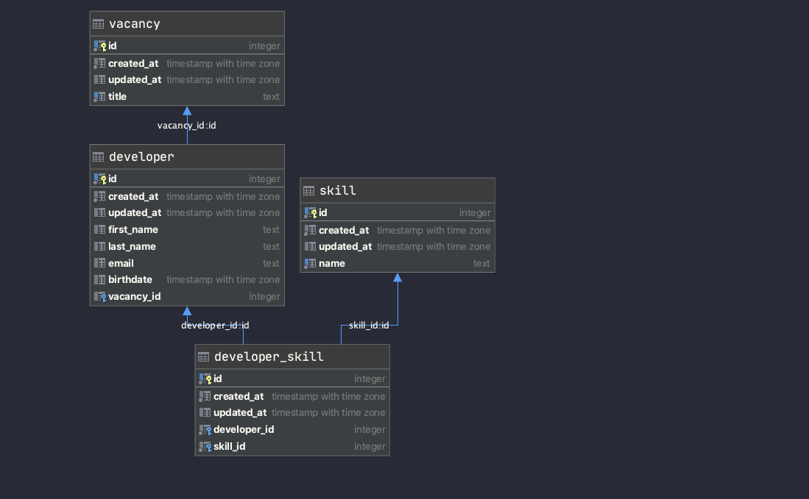

# Lab 2:

## Variant 22:

### Report: [БД_КП81_ЛР2_Янковський_Дмитро.pdf](lab_reports/БД_КП81_ЛР2_Янковський_Дмитро.pdf)

### Screenshots:



### ORM models and API
SQLAlchemy model classes are located in`db_labs/model/`

Run `make run` to spin up the Flask REST API

Requests can be made via Paw  # see `db_labs.paw`

In case you're not using Mac, you can visit `http://localhost:5000/api/swagger#/`

### Before Update and On Delete trigger
Whenever a `vacancy` is updated, before that the `recruitment_status` of all related developers will get set to `in_progress`.

Whenever a `vacancy` is deleted, the `recruitment_status` of all related developers will get set to `rejected`


### GIN and Hash indexes
There are GIN trigram indexes on `developer.first_name` and `developer.last_name`. They speed up the `ILIKE` searches and full text search in general.
```
EXPLAIN ANALYSE select * from developer where first_name ilike '%Dizzzmas%';

CREATE INDEX developer_first_name_trgm_idx ON developer USING GIN (first_name gin_trgm_ops);
CREATE INDEX developer_last_name_trgm_idx ON developer USING GIN (last_name gin_trgm_ops);


DROP INDEX developer_first_name_trgm_idx;
DROP INDEX developer_last_name_trgm_idx;
``` 

There's a Hash index on `developer.recruitment_status` which speeds up the search via direct comparison with the `=` operator.
```
EXPLAIN ANALYSE select * from developer where recruitment_status='rejected';

CREATE INDEX developer_status_idx on developer USING hash (recruitment_status);

DROP index developer_status_idx;
```

### Prerequisites:

```
curl -sSL https://raw.githubusercontent.com/python-poetry/poetry/master/get-poetry.py | python  # poetry
```

## Useful Commands:

### Python Virtual Environment:

```
poetry shell  # activate python virtual environment
poetry install  # install dependencies
```

### Run Dev Server:

```
flask  # CLI commands
make idb # Setup and seed database
make run  # run flask dev server
```


### Database:
Using Postgresql.
```
createdb db_labs  # create DB
flask db upgrade  # run migrations
flask seed  # populate with sample data
flask db migrate  # generate new migration
flask db  # more migration commands
```

### API Documentation:

Once your flask dev server is running:

- [OpenAPI JSON](http://localhost:5000/api/openapi.json) (http://localhost:5000/api/openapi.json)
- [Swagger UI](http://localhost:5000/api/swagger) (http://localhost:5000/api/swagger)
